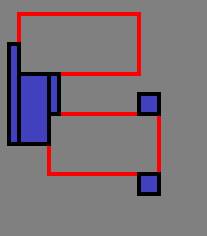
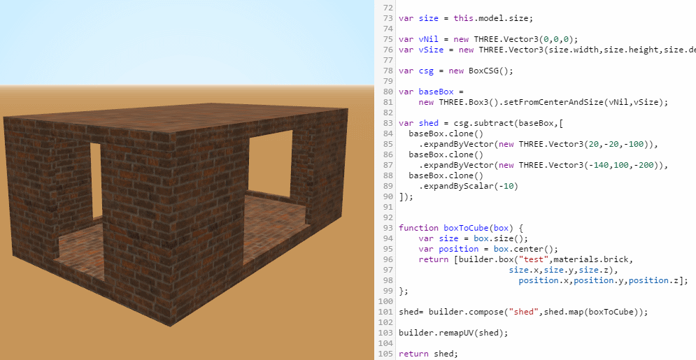

# threejsBoxCSG

Simple Box CSG substraction for `THREE.Box3`.

## example: 

```JavaScript
    var b1 = new THREE.Box2(
      new THREE.Vector3(100, 100),
      new THREE.Vector3(200, 200)
    );

    var b2 = new THREE.Box2(
      new THREE.Vector3(10, 50),
      new THREE.Vector3(60, 150)
    );

    var b3 = new THREE.Box2(
      new THREE.Vector3(50, 120),
      new THREE.Vector3(160, 180)
    );

    var b4 = new THREE.Box2(
      new THREE.Vector3(20, 20),
      new THREE.Vector3(140, 80)
    );

    var subtractees = [b1,b2];
    var subtractors = [b3,b4];
    var result      = new BoxCSG().subtract(subtractees, subtractors);

    // result = an array of the subtracted boxes that remain
```



- Red: the subtractors
- Blue: the remains of the subtractees

## It also works in 3D


